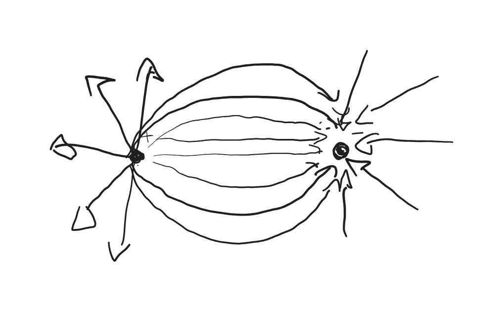

- Segue il [Principio di Sovrapposizione dei campi](Principio%20di%20Sovrapposizione%20dei%20campi.md)
Immaginiamo $q$ come "carica di prova", che deve rispettare $q > 0$ e $q << Q$. ($<<$ = molto minore).

La rappresentazione grafica si effettua tramite le linee di campo, ovvero come questo disegno qui sotto.

Le frecce entrano verso dentro nel caso il punto ($Q$) in caso $Q < 0$.
Il vettore della forza è tangente alla linea di campo.

Ogni carica puntiforme genera un campo, di formula
$$
\vec{E_r}=\frac{Q*\hat{r}}{4\pi\varepsilon_0*r^2}
$$
Il campo totale prodotto da più cariche puntiforme è dato dalla somma vettoriale dei singoli campi.
Il campo si misura in $\frac{N}{C}$ .
# I dipoli
Come succede nella molecola d'acqua, i dipoli sono 2 cariche, che rispettano questa regola $Q_1^+=-Q_2^-$.
Nei dipoli avviene esattamente una cosa del genere:

# Due cariche positive
Con due cariche positive avviene una cosa del genere:
