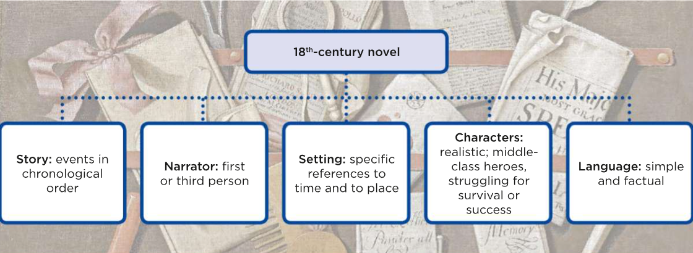

The Augustan age started with the first Hanoverian king who was **George I**, he was German and he didn't spoke well English, so he managed to delegate power to the **Cabinet** ("il gabinetto") headed by the Prime Minister, who in that time was **Sir Robert Walpole**.
There was two main political parties, the **Tories** and the **Whigs**.

The Augustan Age was a golden age form political and cultural debate.
There was a spreading of the Coffee Houses, which were public places where people reunited to talk about social and political concerns.

The new middle class had a greater social mobility. The noblemen started to do grand tours, in which they gone across the Europe, this brought a big Italian influence to architects.

A new religious movement called Methodism brought support and education to the lower classes.

George I was succeed by **George II** who fought  2 foreign wars, the war of Austrian succession, and the Seven Years war. There was also an unsuccessful Scottish Rebellion, who brought an end to the Stuart's claim, because he was headed by Jacobites, who supported the Stuart's return to English's trone. He chose as prime minister William **Pitt**, who had a mercantilist trade policy and aimed to maintain a favorable balance of bower in Europe.
# Political Organization

|               | Whigs                                     | Tories                                        |
| ------------- | ----------------------------------------- | --------------------------------------------- |
| Descendant of | Parlamentarians                           | Royalists                                     |
| Believers in  | Constitutional monarchy, no divine rights | divine right of king, no religious toleration |
| Supported by  | Wealthy and merchant classes              | Church of England and landowners              |
| Later became  | Liberal party                             | Conservative Party                            |
The upper classes from now on includes, along with landowners and aristocracy, also merchants, tradesmen and manufacturers.
There was also a growing middle class, which included artisans, shopkeepers and tradesmen.
The lower class included poor, who lived in urban and rural areas, they had no political right and lived in terrible conditions. They had been affected by smallpox
# Toughs
Generally regarded as a golden age, the 18th century in Britain was called ‘Augustan' after the period of Roman history which had achieved political **stability** and power along with a flourishing of the arts. This was a distinctive moment in the making of modern Britain. It was an age of **traditionalism**, elegance and wit. The virtues of politeness, moderation and rationality were commonly praised. It was a materialistic society – worldly, pragmatic and responsive to economic pressure. Yet, its institutions were **hierarchical**, hereditary and privileged. There was a growing tendency to focus on personal gain and pleasure as the main objectives of life. Elections were largely controlled by the local landowners. Politicians were not concerned with winning over the electorate but with **bribing** them, either with money or with the promise of jobs.

Eighteenth-century society championed **individualism**, seizing opportunities in the sectors of economy that provided scope for initiative, enterprise and enrichment. It was in many ways an extraordinarily free and open age, whose characteristics distinguished Britain from the other European countries. Many travellers were surprised by what they saw as the **comparative** freedom enjoyed by the British people in contrast with the more absolutist regimes of their own countries. Enlightened thinkers, from the philosopher John Locke to journalists such as Joseph Addison, rejected the strict, **pessimistic** values of Puritanism, like original sin and the depravity of man. Liberal thought influenced the new view of the world and affirmed free will, salvation for all, as well as the belief in the goodness of mankind and its capacity for progress. **Optimism** encouraged faith in progress and human perfectibility, and made people eager to try new ways of trusting their own capabilities: reason, which made them different from animals, and common sense.
# Literature

The population who was able to read increased to 60% of adult males and 40% adult females. This was caused by the increased number of volume published by the writers. This became an economic-driven work.
The works wanted to be more realistic, the protagonists were usually from the middle class, struggling for survival or social success. The primary aim of the writer was to write in a simple way to make everyone understand.
## Daniel Defoe
He was born in a Protestant family, he was well-educated. His father wanted for him a religious career but he began working as an apprentice and then he make his own business.
He had financial crisis and he was arrested for his political works like *The Review*. He was brought to the pillory but the third time his friend throw him flowers.
He refused his ideals and become a secret agent for the government.
He started writing stories like Robinson Crusoe and novels like Roxana. He gain money so he could afford a comfortable life. His creditors haunted him 'till his death.
### Robinson Crusoe
His a story about a man who spent nearly 30 years on an island.
He traveled the world to search for success but he is captured by pirates, who get him to Brasil, where he became owner of a successful plantation. While travelling to Africa to buy slaves he is shipwrecked and he find himself alone on a desert island.
He records his struggles to improve his life on the island and reflects on his situation. He made himself the reader and god.
After 12 years he find footprint in the sand and evidences of cannibal activities. He manage to save Friday, one of their victims. He teach him to speak and read the bible. Then he save Friday's father.
After some years he manage to get saved by a ship and find he has become rich by the plantation.

A big part of the book is set on the desert island, where Crusoe is the prototype of the English colonizer.
The book has an individualistic view, where a man can modify reality by working hard. The novel is a Spiritual Autobiography, because God and the Bible are fundamental to Crusoe.
## Jonathan Swift
He was born and educated in Ireland, he gone to England and has been involved in politics, his patron encouraged him to write his first book. He returned to Ireland where he became Dean of a Cathedral. He gave money to poor people and he published his masterpiece: Gulliver's Travel, and also A Modest Proposal.
He did not share the optimism of his age.
### Gulliver's Travel
4 journeys of Gulliver.
In the first he is shipwrecked and arrives to Lilliput (small people)
In the second he arrives to Brobdingnag (gigantic people, he become the king's pet)
In the third voyage he arrive to the flying island of Laputa (book-eaters, the unhappiest people are immortal)
The last voyage lands Gulliver to the Land of the Houyhnhnms (civilized horses who rules Yahoos)

---

Augustan Age inspiring from the emperor August. That was a moment with:
- Political stability
- Flourishing of arts
- *European Grand Tours*
- the middle class as protagonist
	- who had values like the self made man, entrepreneurial skills, rationalism, materialism, optimism, faith in progress
	- they met in coffeehouses
	- they where part of the enlightenment (illuminismo, Newton)
- Enclosures:
	- improved farming and breeding
		- + food (+ farming -> + population)
		- + animals (+ breeding -> + food and textile industry)
	- countryside workers were **dispossessed** of jobs
		- + jobless
		- + homeless
		- + urban population
			- - hygienic conditions
				- + high mortality rate caused by diseases
			- + workhouses
		- + diseases
- Culture
	- More people started reading and writing (the majority of the people very basically)
		- newspapers (the Spectator, Defoe's The Review, The Times): simple and catchy language, interesting news about the local place, they concerned the middle class
		- Pamphlets: political / philosophical essay
		- Comedy of manner: witty ("umoristiche", implicit irony) comedy about middle class manners ("buone maniere"), etiquette, the social protocols
		- Birth of Novels
			- with simple language
			- narrated in chronological order
			- was realistic because the middle class wanted to read about itself, plenty of details, with real names
			- included puritan values (God's plan, punishment for the sin, rewards)

The kings in this age is Hanoverian. They were German because the English didn't wanted anymore a Catholic (see the act of settlement).

They didn't speak well the English so they appointed the prime minister, who, with the Cabinet, acquire a great importance.
> The cabinet was a restricted group of people who had the majority in the parliament.

The kings are
- George I - Hanover
	- Prime minister: Sir Robert Walpole
	- Jacobite rebellions, who liked the Stuart monarchy.
- George II
	- Canada, Montreal, Quebec became English colony -> 7 year war
	- 7 year war
	- Prime minister: Pitt
		- "Created" the English Empire
		- Importation from the colonies:
			- Goods (food, cotton, tea, sugar, tobacco, ...)
			- Raw material (minerals, wood, coal, ...)
		- Exportation to the colonies ("market outlet")
- George III

# Parliament Structure

|                        | Whigs                                                                                             | Tories                                    | Labour Party                 | UKIP                            |
| ---------------------- | ------------------------------------------------------------------------------------------------- | ----------------------------------------- | ---------------------------- | ------------------------------- |
| Creation (century)     | XVII                                                                                              | XVII                                      | XX                           | XX                              |
| Former                 | ...parlamiamentarians & roundheads                                                                | ...royalists                              |                              |                                 |
| They Supported the     | ...**constitutional monarchy**                                                                    | ...the **executive/absolute monarchy**    |                              | ...nationalism, "extreme right" |
| They were supported by | The Middle class (protect "the merchants, landowners, artisans, mines/factory owners"'s business) | The high class, Lord and Noble            | The worker class             |                                 |
| They Protected         | Business and the trade                                                                            | family, the idea of nation and traditions | Free "National Healt System" | Anti immigration policies       |
| Peoples                | Walpole, pitt                                                                                     | Thatcher, Churchill                       | Tony Blair                   | Nigel Farrage                   |

# Defoe
## Robinson Crusoe
Rescue of savage
- physically
- spiritually
- culturally
It's a middle class man because:
- hard work
- desire of fulfillment
- average education
- restlessness
- pragmatism

# Swift
- He was of an English Family
- He was born in Ireland
- He lived in
	- England (he made satirical works)
	- Ireland (Anglican minister: a priest)

Ireland in that moment was:
- under the English crown politically
- officially Anglican, but his people was mostly catholic
- experiences great poverty

## A Modest Propose
- Satire (to denounce social problems)
	- Poverty
	- Neglect by
		- English politics
		- Local Ireland politics
	- Hypocrisy of Irish upper classes
- Scientific Method
	- statistical data
	- figures
	- sources
	- mathematical calculations

# Gulliver's Travel
- **Gulliver is a middle class man**
	- job
	- studied
	- salary
	- hard working
	- self-made men
	- restlessness
	- proud of the society -> he find difficult to explain and justify his society -> he reject his society
- **details** to make it more realistic
	- dates
	- places
	- duration of journeys
	- measurements of food and drinks converted into Lilliputians' size
	- quantity of wheels/materials needed to transport him
	- number of chains
- **personification techniques**
	- 1st person
	- feeling descriptions
- **comical moments**
	- when he peed on the castle to extinguish the fire
	- small/big endians as reasons for war
	- high/low heels as reason for war, mocking to round-heads and long-hairs during the civil war
	- how they choose officials
	- his fight with the fly, wasps and rats
- **social criticism**
	- the way English society was critised by some of the monarchs
- **scientific method**: applied when Lilliputians search though his pockets
- **external perspective on familiar objects and contexts** to describe pocket watch, knife etc
- **themes:**
	- absurdity of wars
- **roles reversal** like tiny-giant, to allow the reader to experience a different point of view and develop critical awareness:
	- you can make/loose your fortune
	- height is a synonym of power
	- tiny people must shout to make their voice heard

---

# Ex 2 page 202
This period so great progress in agricolture, large areas of lands, that was open in the past, was now **enclosed** so their owners could improve productions using new methods of framing and of breeding animals.
The increased production in food lead to a rapid raise in the population. There were also the beginning of industrial productions in rural areas where textile were being produced, the mining of coal and metal was also increased, but as yet insufficient investments to improve this activities and the roads to connect the productive areas where not very good.
This period so