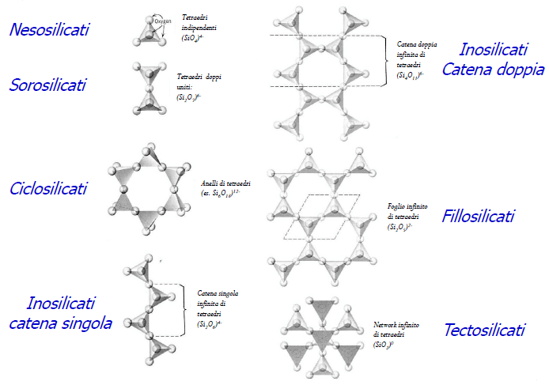

I silicati hanno come mattoncino di base l'anione silicato ($SiO_4^{4-}$) si dividono in sette gruppi:
1. Nesosilicati, piramidi a base triangolare
2. Sorosilicati, 2 piramidi attaccate per la punta
3. Ciclosilicati, più piramidi attaccate, formanod egli anelli
4. Inosilicati (a catena singola), più piramidi che formano una singola catena
5. Inosilicati (a catena doppia), 2 catene collegate
6. Fillosilicati, più catene collegate a formare un piano
7. Tettosilicati, più piani collegati

Se i silicati possono anche essere classificati tramite il rapporto $\frac{silicio}{ossigeno}$. Nel quarzo questo rapporto è il più alto, ($0.5$), mentre nei nesosilicati è molto basso (0.25)

